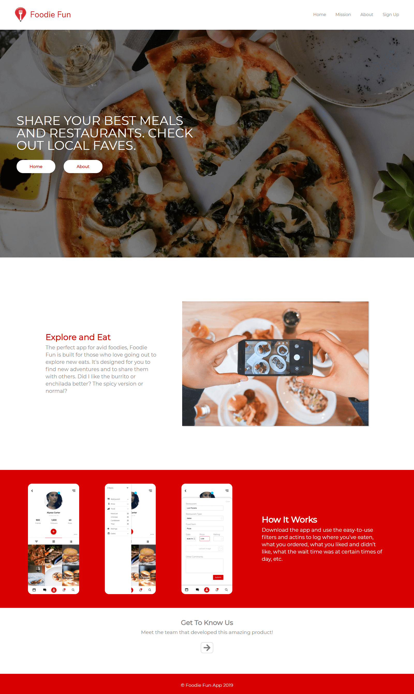
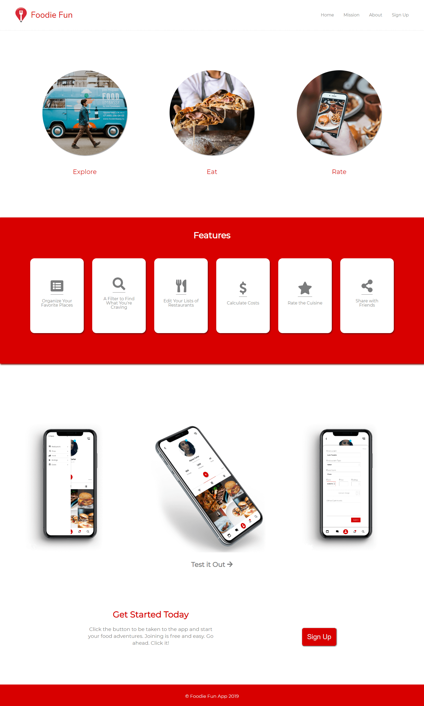
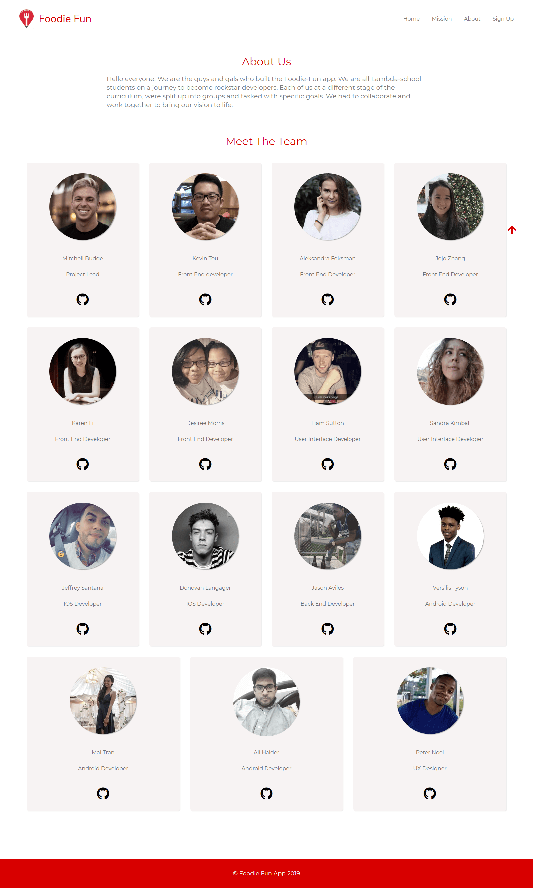
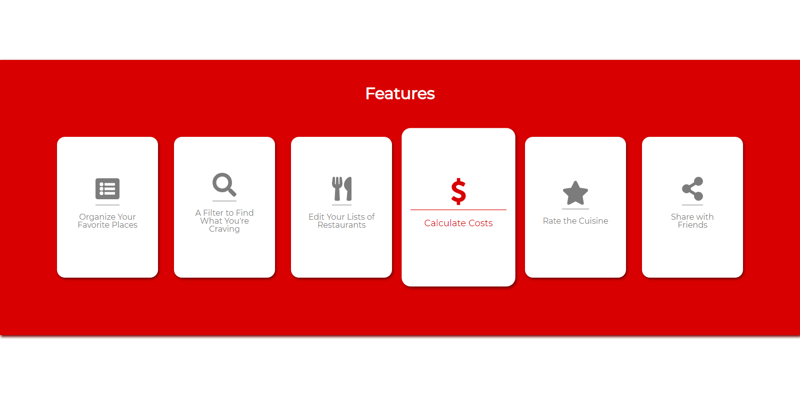
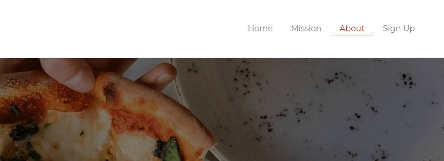
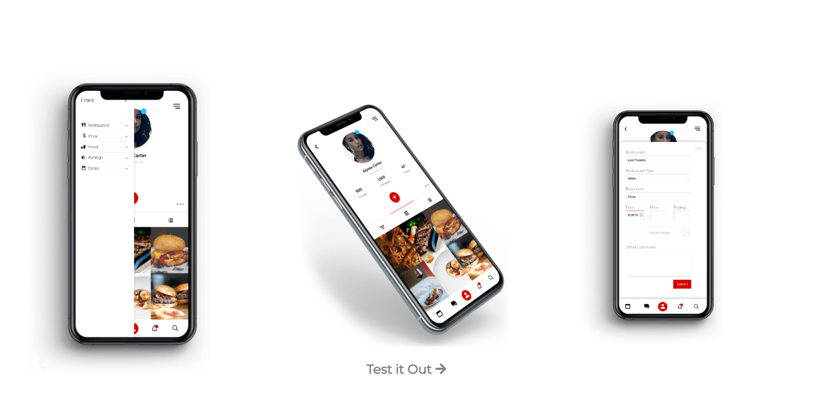

# UI

Pages

Three pages built: Home/Landing, Mission and About. Each with fully functioning navigation and button links.

Animation

Animation applied to buttons and images, including scale enlarging, color changes and shadows.

Liam:
Built the entire About page, created most of the responsive design for mobile, all responsive design for tablets, and also created animation for the navigation and half the site's buttons.

Sandy:
Built the Homepage and Mission page basic layout, images and text, created animations for all the Mission page, and created basic responsive mobile design.

